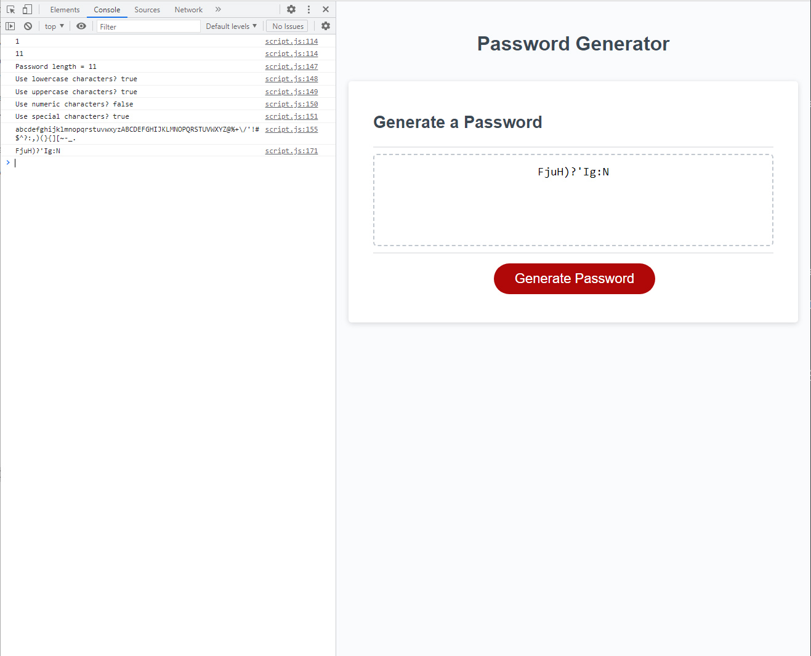

# Password Generator

## Description 

Module 5 challenge - Intermediate JavaScript: Password Generator. Create an app that runs in a browser and features dynamically updated HTML, powered by JavaScript code. 

### User Story

Utlising code learnt on the Bootcamp, and learnt from my own research, together with discussions with my breakout room group, write the password generation code and validation for when the **Generate Password** button is clicked. 

### Acceptance Criteria

* To create a repo called `password-generator`.

* Generate a password when the button is clicked.

* Present a series of prompts for the password criteria.

    - Length of password (between 10 and 64 characters, inclusive)

    - Character type, and whether the generated password does and does not utlise that character type

        - Lowercase

        - Uppercase

        - Numeric

        - Special characters ($@%&*, etc.)

    - Code should validate for each input, and at least one character type should be selected

    - Once all prompts are answered, the password should be generated and displayed in an alert or written to the page

### Deployed Application

View the deployed application for week-5: password-generator at [makemassair.github.io](https://makemassair.github.io/password-generator).

### Screenshot

